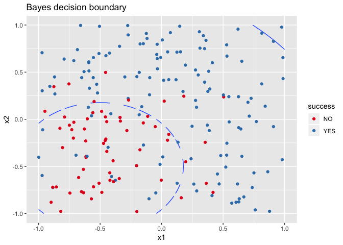

# Building models
### Deviant aggressive behavior
1. If Theory 1 were correct, to reduce deviant aggressive behavior, the government may aim to employ a more punitive approach. Specifically, as one implication of this approach is that individuals learn from experience and perform a cost-benefit analysis in whether to perform a deviant act, the government could employ the death penalty law to discourage deviant aggressive behavior, which would increase the "cost" of performing these deviant acts and therefore reduce the frequency of these acts. For example, Singapore is well-known for utilizing this approach - in October 2018 alone, the Singapore government has executed six men convicted of drug offences.
If theory 2 were correct, the government may aim reduce aggressive behavior would be to decrease the anger felt by employees in workplaces to reduce aggressive behavior. For example, by conducting inspections at workplaces, the government could ensure that all businesses treat employees fairly and must provide sufficient compensation so that the workplace environment remains comfortable. With this policy, employees will presumably be less likely to resent their managers and will thus be less likely to act out. For example, the Danish government ensures that workplaces remain comfortable by conducting surprise inspections at workplaces and fine workplaces that have employees who are undercompensated.
If theory 3 were correct, to reduce deviant aggressive behavior, the government may aim to reduce discrimination and create a more equal society by targeting one group of society. For example, the government could lower the systematic discrimination of females by ensuring that there are policies penalizing exual harrassment in all institutions. In higher education for example, the government has mandated that  
If theory 4 were correct, to reduce deviant aggressive behavior, the government would aim to reduce contact with a deviant subculture. Specifically, the government could segregate or limit interactions with deviant subcultures. For example, if we define "contact" as intimate knowledge of a deviant subculture or deviant acts, one possible policy that the government could employ is the censorship of information. For example, to prevent its citizens from engaging in violence, the Chinese government has decided to ban violent online games so that its citizens will not be exposed to violent acts, even if these acts are not "real". 

2. For example, one case of an "experiment" would be the case of school shootings. In the recent decade, school shooters were largely active or recent students at the school who have largely experienced anger and resentment towards the student population, perceived themselves as victims of others students' bullying and have felt unfairly treated by teachers. Additionally, some of them also have been reported to have a fascination with morbid violence portrayed in the media and wish to "copy" the actions of previous school shooters. Applying this to the four theories then, it is most apparent that theories 2, 3 and 4 are applicable. Specifically, according to theory 2, school shooters seem to feel anger towards those who are in charge of them - the teachers. Additionally, school shooters typically feel oppressed and discriminate against by their schoolmates as seen in theory 3, as they feel that they are victims of bullying. Lastly, applying theory 4, one could even suggest that school shooters are socialized to act out violently through exposure to news about previous school shootings and shooters, to whom they identify with. Perhaps one could even add that most American teenagers are also exposed to violent games and media, which could also increase their propensity to act out violently. That being said, although theory 1 does not apply when having a discussion about a typical school shooter profile, in understanding why these shooters have this particular profile, we can also argue for the evidence of theory 1. In particular, perhaps an explanation for why these shooters come to be resentful of parents and other students, is because students and teachers are not penalized for being unfair to the student or bullying the student. In this sense, the interaction of theory 1 and theory 2 and 3 could suggest a more indepth and complex explanation for explaining the behaviors of deviant aggressive individuals.

## Waiting until the last minute
a. Based on my experience, some people wait until the very last minute to complete a task because they might have no motivation to complete it. For example, if a student takes a class to finish his or her degree requirements but may not be actually interested in the class, the student may only feel motivated to finish an assignment in that class if there is an impending deadline. Additionally, some people also may wait till the very last minute because they plan it so- they might have other deadlines that are more urgent and important in their minds. In particular, some people plan the number of days or hours it takes to finish their tasks, and finishing a task last minute might be inevitable based on their schedule. On the other hand, for very important tasks, some individuals may have anxiety in completing a task. For example, if the task was to submit a well-written assignment for someone they really respect in a bid to impress him/her, the individual may feel stressed to complete it and avoid starting the task till the very last minute.
b. Based on the various explanations above, one possible explanation is that the more overwhelming the perceived task above a certain threshold- in terms of the level of the perceived importance of the task to the source of the task ("I") and the individual's respect for the source of the task ("R"), the more the individual will put it off. To elaborate, above a threshold of "underwhelming" and "normal" anxiety, the level of "overwhelming" anxiety could make an individual more likely to put it off, and this anxiety is constituted of both "I" and "R". Specifically, it must be noted that "I" is perceived- that is, the actual level of importance of the task to the source of the task does not matter, the perceived importance of the task by that individual matters (although there should be a correlation between the actual importance of the task and the perceived importance of the task). Additionally, a certain threshold of anxiety is identified because the individual may, before reaching this threshold, be actually motivated to perform the task well and may in fact start early to have adequate time to complete the task instead, that is, only after a certain threshold from "normal" anxiety to "overwhelming" anxiety will an individual wait till the last minute to complete the task. 
c. Alternatively, based on the idea generation in part a, another model is that when the individual is not motivated, which is constituted by having low interest in the task and perceived low 
It should also be noted that the models above do not explicitly state the length of time one leaves a task till the last minute. That is, Y- the probability of whether one leaves a task till the last minute or not does not explicitly define when and how long is "last minute". 
d. For the first model, two predictions could arise: firstly, one prediction is that the higher the level of "R" and "I", the more likely the individual will put the task off to the last minute. However, this is only after certain threshold- even if "R" and "I" increase, but it does not reach the threshold, the individual will not put the task off, as indicated earlier. To apply this to a more concrete example, if for example, the task is to write a report for your well-respected manager around the time when one is seeking a promotion, the level of "R" and "I" will be high, and if it surpasses the "normal" anxiety, this individual will more likely to put it off. A second prediction is that the even if "I" is low, the individual might still put the task off till the last minute if "R" is high and both "R" and "I" surpass "normal" anxiety to reach "overwhelming" anxiety. The above predictions also assume that the individual in question chooses to take an avoidance approach in the face of ovewhelming anxiety. That is, some individuals, in the face of overwhelming anxiety, choose to cope with this anxiety by venting to loved ones or investing time in their hobbies as a break. In this case, even though the perceived level of importance of the task to the source and the individual's respect for the source of the task may still induce "overwhelming" anxiety for the individual, that individual may not put the task off as he or she is not taking the avoidance approach. It must also be said that this model heavily depends on the individual- that is, the general model- the relationships between "R" and "I", and "Y" should be the same for all individuals but the actual threshold of "normal" anxiety to "overwhelming" anxiety may depend on the sensitivity of the individual to anxiety. 

## Selecting and Fitting a model
1a. When the sample size is very large and the number of predictors is small, the flexible statistical learning method would perform better than an inflexibile method. As the more flexible, the more it will fit the observed data, and with a large sample size, which suggests that the observed data is approximate to the "real" population parameter,  a flexible method will have a smaller error than an inflexible method.

b. When the number of observations is small, a flexible method will perform worse than an inflexible method. As the number of 

c.

d.


```r
set.seed(11) 
n = 200
x1 = runif(n, -1, 1)
x2 = runif(n, -1, 1)
d = data.frame(x1,x2)
epsilon = rnorm(n, mean = 0, sd = 0.5)
y = x1 + x1*x1 + x2 +x2*x2 + epsilon

y_new <- exp(y)/(1+exp(y))
y_new_d <- data.frame(x1, x2, y_new)
y_new_d$success = y_new > 0.5
y_new_d$success[y_new_d$success==TRUE] = "YES"
y_new_d$success[y_new_d$success==FALSE] = "NO"

library(tidyverse)
```

```
## ── Attaching packages ──────────────────────────────────────────────────────────────────────── tidyverse 1.2.1 ──
```

```
## ✔ ggplot2 3.1.0     ✔ purrr   0.2.5
## ✔ tibble  1.4.2     ✔ dplyr   0.7.8
## ✔ tidyr   0.8.2     ✔ stringr 1.3.1
## ✔ readr   1.1.1     ✔ forcats 0.3.0
```

```
## ── Conflicts ─────────────────────────────────────────────────────────────────────────── tidyverse_conflicts() ──
## ✖ dplyr::filter() masks stats::filter()
## ✖ dplyr::lag()    masks stats::lag()
```

```r
bound = expand.grid(x1 = seq(-1, 1, by = 0.05), x2 = seq(-1, 1, by = 0.05))
bound = mutate(bound, ygrid = x1 + x1*x1 + x2 +x2*x2, pgrid = exp(ygrid)/(1+exp(ygrid)), grid_success = pgrid > 0.5)

ggplot(bound, aes(x = x1, y = x2)) + geom_contour(aes(z = pgrid, group = grid_success), bins = 1) +
  geom_point(data = y_new_d, aes(color = success)) +
  scale_color_brewer(type = "qual", palette = 3) +
  labs(title = "Bayes decision boundary")
```

<!-- -->
