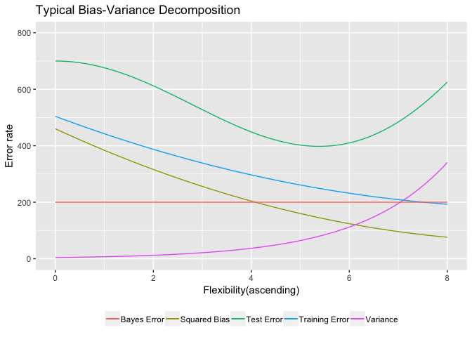
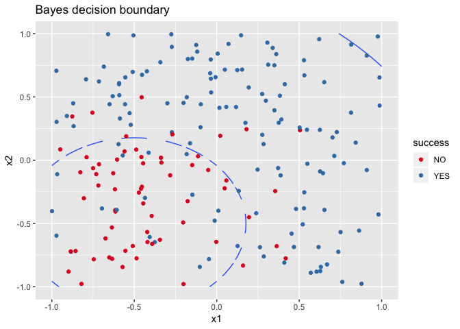

## Bias variance decomposition

```r
library(ggplot2)
sq_bias = function(x) (2 * x - 20)^2 + 60
var = function(x)  exp(x / 1.8) * 4
train_error = function(x) (1.8*x - 18)^2 + 180
test_error = function(x) x^3/2 + 200 * cos(x/2) + 500
bayes_error = function(x) 200

line_width = 0.5
ggplot(data = data.frame(x = 0), mapping = aes(x = x)) + 
  stat_function(fun = test_error, size = line_width, aes(color = "Test Error")) + 
  stat_function(fun = sq_bias, size = line_width, aes(color = "Squared Bias")) + 
  stat_function(fun = var, size = line_width, aes(color = "Variance")) + 
  stat_function(fun = train_error, size = line_width, aes(color = "Training Error")) +  
  stat_function(fun = bayes_error, size = line_width, aes(color = "Bayes Error")) + 
  xlim(0, 8) + ylim(0, 800) + 
  labs(title = "Typical Bias-Variance Decomposition", x="Flexibility(ascending)", 
       y = "Error rate") +
  theme(legend.position = "bottom", legend.direction = "horizontal", 
        legend.title=element_blank())
```

<!-- -->


Generally as flexibility increases, bias decreases and variance increases. With higher flexibility, the model fits the observed data more closely, and the amount by which f would change if we estimated it using a different training set would increase (variance), but the error that is introduced by approximating real life problems using a simplified model decreases (bias). For training error, as flexibility increases, the model fits the training data better and training error decreases as a result. For test error, as flexibility increases, it has a u-shape, as it declines initially but increase again as the model has now overfit the data. For bayes or irreducible error, the error remains constant and whether a method is flexible or inflexible has no effect on it.

## Bayes classifier

```r
#creating the simulated dataset
set.seed(11) 
n = 200
x1 = runif(n, -1, 1)
x2 = runif(n, -1, 1)
d = data.frame(x1,x2)
epsilon = rnorm(n, mean = 0, sd = 0.5)
y = x1 + x1*x1 + x2 +x2*x2 + epsilon
y_new <- exp(y)/(1+exp(y))
y_new_d <- data.frame(x1, x2, y_new)
y_new_d$success = y_new > 0.5
y_new_d$success[y_new_d$success==TRUE] = "YES"
y_new_d$success[y_new_d$success==FALSE] = "NO"

#creating the grid/data for the plot
library(tidyverse)
```

```
## ── Attaching packages ──────────────────────────────────────────────────────────────────────── tidyverse 1.2.1 ──
```

```
## ✔ tibble  1.4.2     ✔ purrr   0.2.5
## ✔ tidyr   0.8.2     ✔ dplyr   0.7.8
## ✔ readr   1.1.1     ✔ stringr 1.3.1
## ✔ tibble  1.4.2     ✔ forcats 0.3.0
```

```
## ── Conflicts ─────────────────────────────────────────────────────────────────────────── tidyverse_conflicts() ──
## ✖ dplyr::filter() masks stats::filter()
## ✖ dplyr::lag()    masks stats::lag()
```

```r
bound = expand.grid(x1 = seq(-1, 1, by = 0.05), x2 = seq(-1, 1, by = 0.05))
bound = mutate(bound, ygrid = x1 + x1*x1 + x2 +x2*x2, 
               pgrid = exp(ygrid)/(1+exp(ygrid)), 
               grid_success = pgrid > 0.5)

#plotting the boundary
ggplot(bound, aes(x = x1, y = x2)) + geom_contour(aes(z = pgrid, group = grid_success), 
                                                  bins = 1) +
  geom_point(data = y_new_d, aes(color = success)) +
  scale_color_brewer(type = "qual", palette = 6) +
  labs(title = "Bayes decision boundary")
```

<!-- -->
